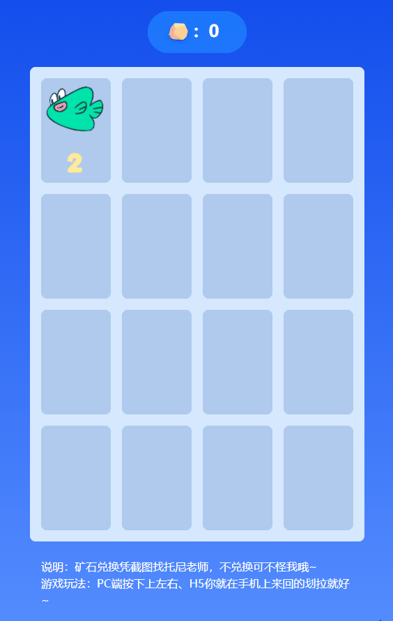

# 怎么才能快速获取矿石，快来【掘金牌2048】吧

## 写在前面

2048这款游戏最早发布于2014年，玩法也比较简单，就是通过方向键去滑动页面，然后页面中的数字向指定方向靠拢，如果数字相同则进行数字合并。

最近我使用Vue3+TS+Tailwind复现了这款游戏，演示如下：



这款游戏同时做了响应式，可以在手机上无障碍的使用。

> 注：游戏中获得的矿石仅供娱乐！
> 该项目使用的模板是[vue-template](https://github.com/ywanzhou/juejin-2048)。

### 为什么选用Vue3

首先游戏并不是很复杂，也不需要使用游戏引擎，比如说cocos；然后我又不想去操作原生DOM，所以我选择了数据驱动的框架Vue3；这样的话我不需要去关系如何操作DOM元素，只需要关注数据就好。

还有一点就是setup语法糖确实香，这里推荐两篇自己的文章：

- []()
- []()

## 游戏素材

游戏中的所有素材，全部来源于掘金账号发布的文章或者沸点发布的图片，使用PS进行抠图，如下图：

<!-- TODO:img -->

如果你需要这个PSD源文件，可以直接去GitHub上获取，地址在文章的最后。

## 页面布局

这个页面布局方式我使用的是Grid布局，全程使用TailwindCSS，几乎没有写CSS代码，其中`<template>`代码如下：
```html
<!-- App.vue -->
<template>
  <div
    class="warp h-screen lg:w-[480px] md:w-screen m-auto flex flex-col justify-center items-center select-none"
  >
    <div>
      <h4
        class="font-bold text-2xl mb-5 flex bg-[rgba(30,128,255,.8)] rounded-full text-white pt-3 pr-10 pb-2 pl-6"
      >
        <!-- 矿石图标 -->
        <OreIcon />
        ：{{ score }}
      </h4>
    </div>
    <div
      class="container bg-[#D6E8FF] w-full lg:h-[680px] md:h-[520px] grid grid-cols-4 grid-rows-4 gap-4 p-4 rounded-lg"
      @touchstart="handleTouchStart"
      @touchend="handleTouchEnd"
    >
      <span v-for="(item, index) in dataArray" :key="index" class="grid-item">
        <div v-for="inx in n2048" :key="inx">
          
        </div>
      </span>
    </div>
    <div class="mt-2 text-left w-full p-4 text-white">
      <p>说明：矿石兑换凭截图找托尼老师，不兑换可不怪我哦~</p>
      <p>游戏玩法：PC端按下上左右、H5你就在手机上来回的划拉就好~</p>
    </div>
  </div>
</template>
<style>
@keyframes scale {
  0% {
    transform: scale(0.5);
  }
  100% {
    transform: scale(1);
  }
}
.animate-scale {
  animation: scale 0.2s ease;
}
</style>
```
以上代码就是一个简单的Grid布局，如果我哪里写的有问题欢迎留言指正。

## 核心代码

首选我们实现一个整个游戏的核心，就是合并的卡片的那个功能，首先我们只考虑一行，且只能左滑，需要实现的效果如下图所示：


分析上图，梳理的思路如下：
1. 默认接收一个长度为4的数组，没有数据以0填充；
2. 定义一个空数组，用于存储处理后的数据并返回；
3. 遍历一行中的4个值，如果当前值为0，则跳出本次循环；
4. 记录索引的下一个，用于比较两个值两个值是否相等，如果相等`push`二倍值，`i++`（跳过下一个，因为下一个已经与当前相加），否则直接`push`当前值。
5. 到此为止基本功能就已经实现了，但是如果是上图中的第三种情况，得到的结果就会是`[2, 4]`，这很显然结果不是我们想要的，我们需要的结果是`[2, 4]`，出现这个问题的原因是空值我们使用的是0，在第一次判断的时候并不成立，所以如果`j`的值是0时，我们需要将`j`指向下一个，直到非0为止；
6. 最后一步，我们需要返回一个长度为4的数组从而替换之前那个数组。

实现代码如下：
```ts
const _2048 = (arr: number[], boo = true) => {
  const newArr: number[] = []
  for (let i = 0; i < arr.length; i++) {
    // 如果当前的数值为0直接跳出本次循环
    if (!arr[i]) continue
    // 当出现 32768 表示游戏结束（因为没有比32768更大的图了）
    if (arr[i] === 32768) {
      // TODO 游戏结束 win
      gameOverBox()
      return []
    }
    let j = i + 1
    for (; j < arr.length; j++) {
      if (arr[j] !== 0) break
    }
    // 比较是否相等，将结果push到新数组中
    if (arr[i] === arr[j]) {
      // 加分操作
      newArr.push(arr[i] + arr[j])
      i++
    } else {
      newArr.push(arr[i])
    }
  }
  // 补0
  return [0, 0, 0, 0].map((v, i) => newArr[i] || v)
}
```

到此为止我们的核心函数就编写好了，实际上，这个函数适用于所有方向，我们只需要根据不同顺序，传递参数即可。

我们就拿第一行和第一列举例，左滑传递的索引为`[0, 1, 2, 3]`，右滑就是`[3, 2, 1, 0]`，上滑`[0, 4, 8, 12]`，下滑就是`[12, 8, 4, 0]`；

我们就将这个顺序定义为一个常量，在使用的时候作为参数传递：
```ts
const DATA_PROPS = {
  ArrowLeft: [
    [0, 1, 2, 3],
    [4, 5, 6, 7],
    [8, 9, 10, 11],
    [12, 13, 14, 15],
  ],
  ArrowUp: [
    [0, 4, 8, 12],
    [1, 5, 9, 13],
    [2, 6, 10, 14],
    [3, 7, 11, 15],
  ],
  ArrowRight: [
    [3, 2, 1, 0],
    [7, 6, 5, 4],
    [11, 10, 9, 8],
    [15, 14, 13, 12],
  ],
  ArrowDown: [
    [12, 8, 4, 0],
    [13, 9, 5, 1],
    [14, 10, 6, 2],
    [15, 11, 7, 3],
  ],
}
```

到这也就应该知道了这个游戏的核心是一个长度为16的数组，页面上显示空的地方在数组中的值为0.

## 创建新的卡片

现在我们开始编写创建新的卡片的函数，其思路如下：
1. 获取长度为16的数组中数值为0的索引，将其保存为一个数组；
2. 随机获取这个数组中的一个值，作为我们添加新卡片的索引；
3. 在想添加的数值中随机添加一个数组进去。

实现代码如下：
```ts
// 创建
const create = (arr: number[]) => {
  // 查找数组中未0的索引，将其保存到一个数组中
  const val0Arr = findIndexAll(arr, 0)

  const random = Math.floor(Math.random() * val0Arr.length)
  const index = val0Arr[random]
  const newArr = [2, 4, 8]
  arr[index] = newArr[Math.floor(Math.random() * newArr.length)]
}
// 在数组中查找所有出现的x，并返回一个包含匹配索引的数组
const findIndexAll = (arr: number[], x: number) => {
  const results = [],
    len = arr.length
  let pos = 0
  while (pos < len) {
    pos = arr.indexOf(x, pos)
    if (pos === -1) {
      //未找到就退出循环完成搜索
      break
    }
    results.push(pos) //找到就存储索引
    pos += 1 //并从下个位置开始搜索
  }
  return results
}
```


## 游戏开始

### 工具函数

在游戏开始之前，我们需要先定义两个工具函数，一个是用于将返回的新数组更新到数组中的函数，另一个是将传递一个方向的4个索引序列，分别调用更新函数。实现代码如下：
```ts
const setArrayVal = (arr: number[], index: number[], value: number[]) => {
  index.forEach((val, index) => {
    arr[val] = value[index]
  })
}
const ArrComputed = (arr: number[], direction: DirectionType, bool = true) => {
  DATA_PROPS[direction].forEach(_ => {
    const newArr = _2048([arr[_[0]], arr[_[1]], arr[_[2]], arr[_[3]]], bool)
    setArrayVal(arr, _, newArr)
  })
}
```

### 定义游戏开始函数

这个函数比较简单，只需要将前面两个函数调用，再次之前判断游戏是否结束即可，实例代码如下：

```ts
const run = (direction: DirectionType) => {
  // over 用于记录游戏是否结束
  if (over.value) return

  ArrComputed(dataArray.value, direction)
  // TODO: 判断游戏是否结束
  create(dataArray.value)
}
```

### 监听PC端事件

PC端的话只需要监听键盘事件，然后调用我们的`run`函数即可，示例代码如下：
```ts
const DirectionArr: DirectionType[] = [
  'ArrowLeft',
  'ArrowRight',
  'ArrowUp',
  'ArrowDown',
]
document.addEventListener('keyup', (e: KeyboardEvent) => {
  if (DirectionArr.find(item => item === e.key)) {
    run(e.key as unknown as DirectionType)
  }
})
```

### 监听移动端事件

移动端我们需要监听`touch`事件，还需要判断滑动方向，这里我们采用`touchstart`记录开始位置，`touchend`记录结束位置，两者相减就是滑动方向；

示例代码如下：
```ts
const moveXY = {
  startX: 0,
  startY: 0,
  endX: 0,
  endY: 0,
}
const handleTouchStart = (e: TouchEvent) => {
  e.preventDefault()
  // 获取开始的位置
  moveXY.startX = e.touches?.[0].pageX
  moveXY.startY = e.touches?.[0].pageY
}
const handleTouchEnd = (e: TouchEvent) => {
  e.preventDefault()
  // 获取结束的位置
  moveXY.endX = e.changedTouches?.[0].pageX
  moveXY.endY = e.changedTouches?.[0].pageY
  // 获取滑动距离
  const distanceX = moveXY.endX - moveXY.startX
  const distanceY = moveXY.endY - moveXY.startY
  // 判断滑动方向
  if (Math.abs(distanceX) > Math.abs(distanceY) && distanceX < 0) {
    run('ArrowLeft')
  } else if (Math.abs(distanceX) > Math.abs(distanceY) && distanceX > 0) {
    run('ArrowRight')
  } else if (Math.abs(distanceX) < Math.abs(distanceY) && distanceY < 0) {
    run('ArrowUp')
  } else if (Math.abs(distanceX) < Math.abs(distanceY) && distanceY > 0) {
    run('ArrowDown')
  }
}
```

到这里，我们就可以看到这个游戏已经可以运行了，且兼容移动端。


## 游戏结束

### 游戏结束弹框组件

首先我们编写一个游戏结束的弹框组件，示例代码如下：
```html
<script setup lang="ts">
import { withDefaults } from 'vue'
import { useVModel } from '@vueuse/core'
import OreIcon from './OreIcon.vue'
interface Props {
  modelValue: boolean
  score: number
}
const props = withDefaults(defineProps<Props>(), {
  modelValue: false,
  score: 0,
})
const emits = defineEmits(['update:modelValue', 'restart'])
const show = useVModel(props, 'modelValue', emits)
const handleReStart = () => {
  emits('restart')
}
</script>

<template>
  <div v-show="show" class="w-screen h-screen fixed inset-0">
    <div class="mask bg-black opacity-50 absolute inset-0"></div>
    <div
      class="h-60 w-[420px] bg-white rounded-3xl absolute inset-0 m-auto p-6 flex flex-col"
    >
      <div class="text-center text-xl">游戏结束</div>
      <span class="text-2xl flex justify-center mt-3 flex-grow items-center"
        >获得
        {{ props.score }}

        <OreIcon />
      </span>
      <el-button
        type="primary"
        size="large"
        round
        class="w-full mt-2"
        @click="handleReStart"
        >重新开始</el-button
      >
    </div>
  </div>
</template>

```

双向数据绑定我们通过vueuse的`useVModel`实现，不得不说这个hooks库真的香。

### 如何判断游戏结束

判断游戏结束这里我偷了一下懒，直接去通过函数的方式去执行滑动，执行完毕后如何4个方向的值与当前保持一致，说明已经不可以进行滑动了，所以游戏就结束了。

> 值得注意的是，测试的数组必须是原数组进行深拷贝的数组。

实现代码如下：

```ts
// 游戏结束的判断
const gameOver = (arr: number[]) => {
  const oldArr = JSON.stringify(arr)

  const testArr = JSON.parse(JSON.stringify(arr))
  // 计算四个方向
  const _res: string[] = []
  DirectionArr.forEach(item => {
    ArrComputed(testArr, item, false)
    _res.push(JSON.stringify(testArr))
  })

  if (_res.filter(i => i === oldArr).length == 4) {
    // 游戏结束
    over.value = true
    // TODO：打开游戏结束的弹框组件
  }
}
```

现在我们在之前开始游戏的函数中调用这个函数，就可以进行游戏结束的判断了。

## 重新开始

重新开始就比较简单了，只需要将数据重置即可，示例代码如下：

```ts
// 数组重置的函数
const restart = () => {
  const arr = Array.apply(null, Array(16)).map(Number.prototype.valueOf, 0)
  const random1 = Math.floor(Math.random() * arr.length)
  const random2 = Math.floor(Math.random() * arr.length)
  arr[random1] = 2
  arr[random2] = 4
  return arr
}

// 重新开始
const handleReStart = () => {
  show.value = false
  dataArray.value = restart()
  score.value = 0
  over.value = false
}
```
完结撒花~~~

## 写在最后

这个游戏的源代码在[GitHub](https://github.com/ywanzhou/juejin-2048)开源(欢迎⭐)，如果你有很好的想法，可以fork仓库，甚至是clone核心代码，改版成任何你喜欢的样子。

如果本篇文章对你有帮助可以点赞评论支持一下，谢谢~

> 如果文中，代码中存在错误，还请指正；如果你有好的idea提出来，我满足~